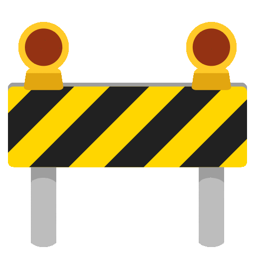
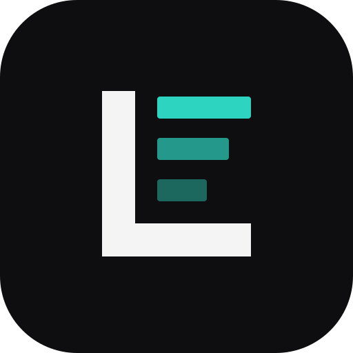
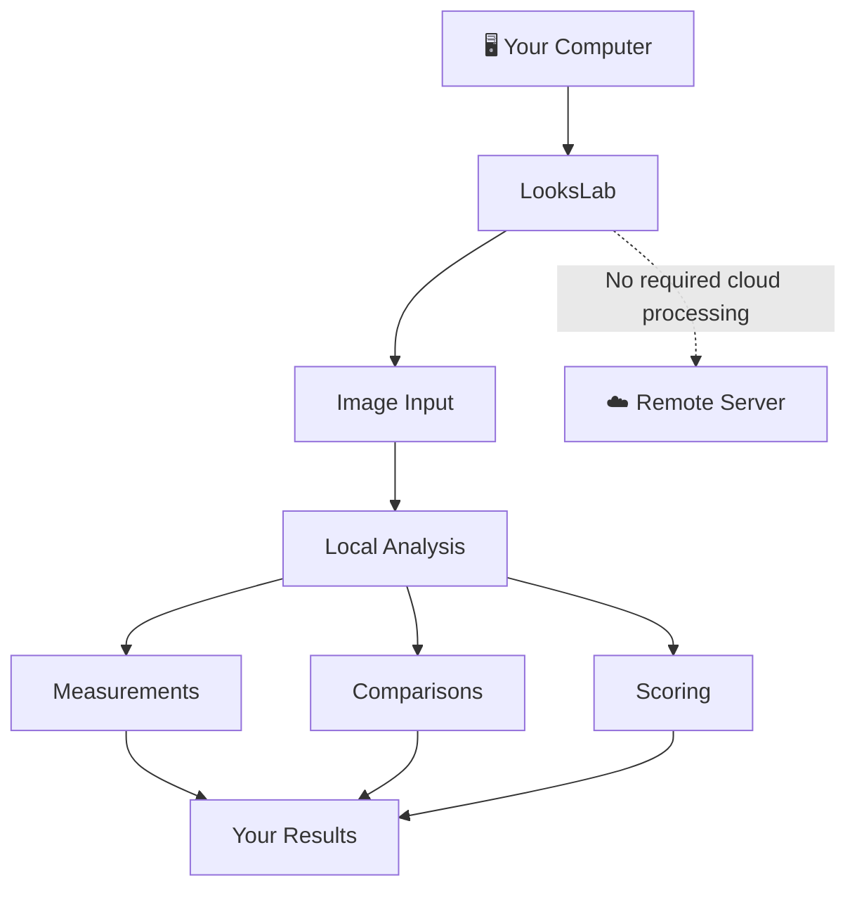
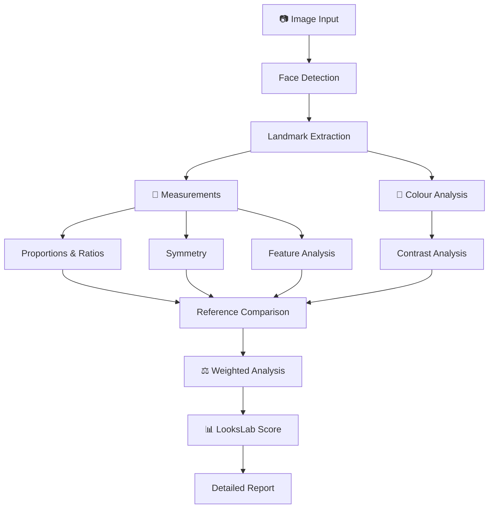

# LooksLab

---
<p align="center">
  
</p>

> **EARLY DEVELOPMENT — NOT INSTALLABLE YET**
>
> LooksLab is currently in its initial development stage. There is no stable release or installation package yet.

<p align="center">
  
</p>
<h1 align="center">What is LooksLab?</h1>

Looksmaxxing has become increasingly fragmented into subscription-based apps that perform a handful of measurements, attach a score to them, and put the results behind a paywall.

**LooksLab takes a different approach.**

It is being built as an **all-in-one, open-source, completely local looksmaxxing toolkit** for people who want to actually examine the numbers behind facial aesthetics.

Instead of paying a recurring subscription for calculations that can be performed on your own computer, LooksLab aims to put the entire analytical toolkit in one application.

**Your face. Your measurements. Your standards. Your weights. Your data.**

---

<h1 align="center"> 🔬 What LooksLab aims to do </h1>

LooksLab is intended to cover the analytical side of looksmaxxing from end to end.

<h3>📐 Measure</h3>

Extract and analyse facial geometry, including:

<span style="display: inline-block; background-color: #E8F4FF; color: #000000; padding: 8px 6px; margin: 6px 0; border-radius: 4px;">Landmarks</span> · <span style="display: inline-block; background-color: #EAF7EA; color: #000000; padding: 8px 6px; margin: 6px 0; border-radius: 4px;">Distances</span> · <span style="display: inline-block; background-color: #FFF4D6; color: #000000; padding: 8px 6px; margin: 6px 0; border-radius: 4px;">Angles</span> · <span style="display: inline-block; background-color: #FDE8F0; color: #000000; padding: 8px 6px; margin: 6px 0; border-radius: 4px;">Ratios</span> · <span style="display: inline-block; background-color: #F0E8FF; color: #000000; padding: 8px 6px; margin: 6px 0; border-radius: 4px;">Proportions</span> · <span style="display: inline-block; background-color: #E5F7F5; color: #000000; padding: 8px 6px; margin: 6px 0; border-radius: 4px;">Symmetry</span> · <span style="display: inline-block; background-color: #FFF0E1; color: #000000; padding: 8px 6px; margin: 6px 0; border-radius: 4px;">Facial thirds</span> · <span style="display: inline-block; background-color: #F1F1F1; color: #000000; padding: 8px 6px; margin: 6px 0; border-radius: 4px;">Facial fifths</span>

Individual facial features can also be examined rather than reducing the entire face to a single number.

<h3> 🗿 Analyse morphology </h3>

LooksLab is designed to analyse structural characteristics and relationships between facial features.

The goal isn't simply to answer:

<span style="display: inline-block; background-color: #fdc2c2; color: #000000; padding: 8px 6px; margin: 6px 0; border-radius: 4px;">**"How attractive are you?"**</span>

It is to answer:

<span style="display: inline-block; background-color: #E5F7F5; color: #000000; padding: 8px 6px; margin: 6px 0; border-radius: 4px;">**"What exactly is being measured, how does it compare, and how much does each factor contribute?"**</span>

---

### 🎨 Colour & contrast

Facial aesthetics aren't purely geometric.

LooksLab is intended to include analysis of:

 Skin colour <br/>
 Undertones <br/>
 Facial colour relationships <br/>
 Feature contrast <br/>
 Overall facial contrast <br/>
 Hair/skin/eye contrast <br/>
 Other colour-based characteristics <br/>

---

# ⚖️ Not every measurement has to matter equally

One of LooksLab's core concepts is **weighted analysis**.

Different people may want different aspects of facial aesthetics to have different importance.

Instead of locking every analysis into one immutable formula, LooksLab can treat priorities like adjustable dials:

| Priority | Influence |
|:--|:--|
| 🪞 **Symmetry** | `████████░░░░░░░░░░░░` **20%** |
| 📐 **Proportions** | `██████░░░░░░░░░░░░░░` **15%** |
| 🎨 **Contrast** | `████░░░░░░░░░░░░░░░░` **10%** |
| 🧩 **Everything else** | `······················` *configured by you* |

<span style="display: block; background-color: #F1F1F1; color: #000000; padding: 8px 6px; margin: 12px auto; border-radius: 30px; text-align: center;">**Your face. Your priorities. Your formula.**</span>

LooksLab aims to allow the influence of individual measurements and categories to be adjusted.

This allows the final result to respond to the user's chosen priorities.

---

<h1 align="center"> 🎯 Your standard doesn't have to be ours </h1>

LooksLab isn't intended to lock users into one definition of an "ideal" face.

Reference values can be changed.

That means measurements can potentially be compared against:

**LooksLab defaults**

 **Custom ideal measurements** <br/>

 **Another person's measurements** <br/>

 **A reference face** <br/>

 **A particular aesthetic standard** <br/>

 **Your own target** <br/>

The same analytical system can therefore be used with different standards rather than assuming that one universal face is the target.

---

<h1 align="center">📊 The LooksLab Score</h1>

LooksLab will have its own scoring system built around the measurements and weights defined within the application.

The important distinction is that the score is intended to be **decomposable**.

Rather than:

```text
YOU: 72/100
```

the objective is to make it possible to understand **why** a result was produced.

```text
Overall
████████████████░░░░  78

Symmetry
██████████████████░░  89

Facial Proportions
███████████████░░░░░  76

Feature Harmony
██████████████░░░░░░  71

Contrast
████████████████░░░░  81
```

Weights can alter how strongly individual measurements affect the final result.

---

<h1 align="center"> 🧬 The idea </h1>

LooksLab is built around a relatively simple premise:

<span style="display: block; color: #F1F1F1; padding: 12px 16px; margin: 12px 0; border-radius: 16px; font-size: 16px;">**“If something can be measured on your device, it shouldn't need a subscription to travel to the cloud.”**</span>

A large portion of facial analysis consists of geometry, image processing, comparisons, ratios, colour calculations and statistical operations.

LooksLab aims to make those tools:

**Open. Local. Configurable. Transparent.**

No cloud analysis.

No mandatory account.

No recurring subscription.

No requirement to upload your face to someone else's server.

---

<h1 align="center"> 🔒 Privacy by default </h1>

LooksLab is designed to operate **entirely locally**.

Your facial images and analysis data are intended to remain on your computer.

There is no requirement for a remote server to perform the core analysis.



Your face shouldn't have to leave your machine just to calculate a ratio.

---

<h1 align="center"> 🧪 Built as an analytical toolkit </h1>

LooksLab is not intended to be a single-purpose "face rating" application.

The long-term vision is closer to a **facial aesthetics laboratory**.

You should be able to inspect the individual components behind an analysis rather than receiving an opaque result.

---

<h1 align="center"> 🛠️ Technology </h1>

LooksLab is currently being developed as a **Tauri desktop application**.

The frontend intentionally uses vanilla web technologies:

```text
HTML
```
```text
CSS
```
```text
JavaScript
```

No frontend framework is required for the current architecture.

The application is intended to combine the flexibility of web technologies with the capabilities of a native desktop application.

### Current stack

| Component         | Technology         |
| ----------------- | ------------------ |
| Desktop framework | Tauri              |
| Frontend          | HTML               |
| Styling           | CSS                |
| Logic             | JavaScript         |
| Processing        | Local              |
| License           | Apache License 2.0 |

---

<h1 align="center"> 🚧 Development status </h1>

LooksLab is **very early in development**.

At present, the project consists of its **initial codebase** and is **not yet available as an installable release**.

There is currently no stable version to download.

The architecture, analysis methods, scoring models and interface are expected to evolve substantially as development progresses.

---

<h1 align="center"> 🗺️ Roadmap </h1>

The roadmap is intentionally left open while the core architecture is being established.

The eventual development path is expected to cover the major parts of the LooksLab system:



More concrete milestones will be defined as the implementation matures.

---

<h1 align="center"> 🖥️ Installation </h1>

**Not available yet.**

LooksLab does not currently have a packaged installer or stable release.

Installation instructions will be added when the first usable development/release build is available.

---

<h1 align="center"> 🤝 Contributing </h1>

LooksLab is intended to be **fully open source**.

As development progresses, contributions can potentially cover areas such as:

<span style="display: inline-block; background-color: #E8F4FF; color: #000000; padding: 8px 6px; margin: 6px 0; border-radius: 4px;">Computer Vision</span> · <span style="display: inline-block; background-color: #EAF7EA; color: #000000; padding: 8px 6px; margin: 6px 0; border-radius: 4px;">Facial Geometry</span> · <span style="display: inline-block; background-color: #FFF4D6; color: #000000; padding: 8px 6px; margin: 6px 0; border-radius: 4px;">Colour Science</span> · <span style="display: inline-block; background-color: #FDE8F0; color: #000000; padding: 8px 6px; margin: 6px 0; border-radius: 4px;">UI/UX</span> · <span style="display: inline-block; background-color: #F0E8FF; color: #000000; padding: 8px 6px; margin: 6px 0; border-radius: 4px;">Scoring Models</span> · <span style="display: inline-block; background-color: #E5F7F5; color: #000000; padding: 8px 6px; margin: 6px 0; border-radius: 4px;">Performance</span> · <span style="display: inline-block; background-color: #FFF0E1; color: #000000; padding: 8px 6px; margin: 6px 0; border-radius: 4px;">Documentation</span>

The project is currently too early for a formal contribution workflow, but contributions and experimentation will become increasingly useful as the core architecture stabilises.

---

<h1 align="center"> 📜 License </h1>

LooksLab is licensed under the:

**Apache License, Version 2.0, January 2004**

See [`LICENSE`](LICENSE) for the complete license text.

---

<h1 align="center"> ⚠️ Disclaimer </h1>
LooksLab provides **quantitative measurements, comparisons and configurable aesthetic analyses**.

Its scores and reference standards should not be interpreted as objective measurements of a person's worth, desirability, or inherent value.

Facial aesthetics involve both measurable characteristics and subjective judgments. LooksLab is intended as an analytical tool—not an absolute authority on attractiveness.

---

<p align="center">

**Looksmaxxing, quantified.**

**Open source. Local first. No subscription.**

</p>
