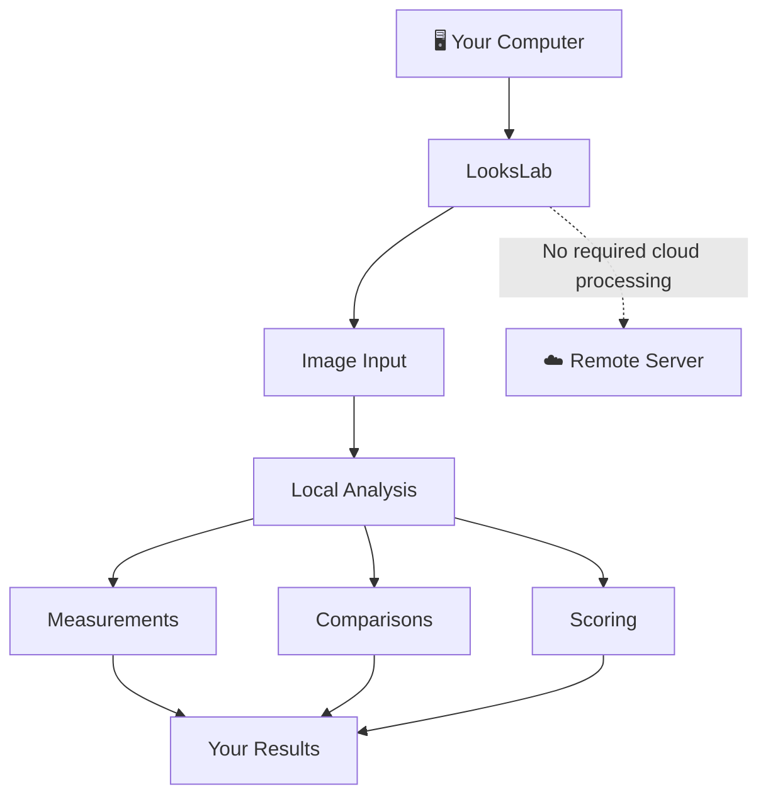
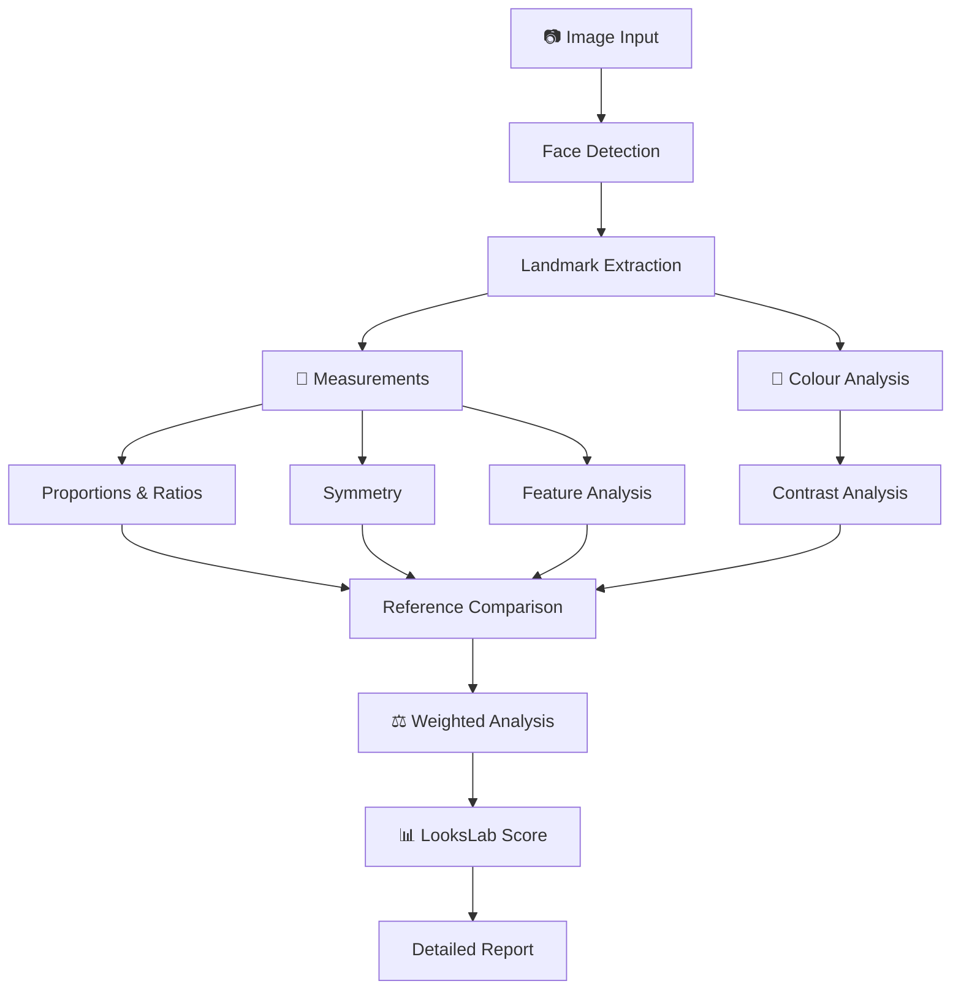

# LooksLab

---

> 🚧 **EARLY DEVELOPMENT — NOT INSTALLABLE YET**
>
> LooksLab is currently in its initial development stage. There is no stable release or installation package yet.


## What is LooksLab?

Looksmaxxing has become increasingly fragmented into subscription-based apps that perform a handful of measurements, attach a score to them, and put the results behind a paywall.

**LooksLab takes a different approach.**

It is being built as an **all-in-one, open-source, completely local looksmaxxing toolkit** for people who want to actually examine the numbers behind facial aesthetics.

Instead of paying a recurring subscription for calculations that can be performed on your own computer, LooksLab aims to put the entire analytical toolkit in one application.

**Your face. Your measurements. Your standards. Your weights. Your data.**

---

# 🔬 What LooksLab aims to do

LooksLab is intended to cover the analytical side of looksmaxxing from end to end.

### 📐 Measure

Extract and analyse facial geometry, including:

`Landmarks` · `Distances` · `Angles` · `Ratios` · `Proportions` · `Symmetry` · `Facial thirds` · `Facial fifths`

Individual facial features can also be examined rather than reducing the entire face to a single number.

### 🗿 Analyse morphology

LooksLab is designed to analyse structural characteristics and relationships between facial features.

The goal isn't simply to answer:

> **"How attractive are you?"**

It is to answer:

> **"What exactly is being measured, how does it compare, and how much does each factor contribute?"**

---

### 🎨 Colour & contrast

Facial aesthetics aren't purely geometric.

LooksLab is intended to include analysis of:

* Skin colour
* Undertones
* Facial colour relationships
* Feature contrast
* Overall facial contrast
* Hair/skin/eye contrast
* Other colour-based characteristics

---

# ⚖️ Not every measurement has to matter equally

One of LooksLab's core concepts is **weighted analysis**.

Different people may want different aspects of facial aesthetics to have different importance.

Instead of having an immutable formula such as:

```text
Feature A = 20%
Feature B = 15%
Feature C = 10%
...
```

LooksLab aims to allow the influence of individual measurements and categories to be adjusted.

This allows the final result to respond to the user's chosen priorities.

---

# 🎯 Your standard doesn't have to be ours

LooksLab isn't intended to lock users into one definition of an "ideal" face.

Reference values can be changed.

That means measurements can potentially be compared against:

**LooksLab defaults**

→ **Custom ideal measurements**

→ **Another person's measurements**

→ **A reference face**

→ **A particular aesthetic standard**

→ **Your own target**

The same analytical system can therefore be used with different standards rather than assuming that one universal face is the target.

---

# 📊 The LooksLab Score

LooksLab will have its own scoring system built around the measurements and weights defined within the application.

The important distinction is that the score is intended to be **decomposable**.

Rather than:

```text
YOU: 72/100
```

the objective is to make it possible to understand **why** a result was produced.

```text
Overall
████████████████░░░░  78

Symmetry
██████████████████░░  89

Facial Proportions
███████████████░░░░░  76

Feature Harmony
██████████████░░░░░░  71

Contrast
████████████████░░░░  81
```

Weights can alter how strongly individual measurements affect the final result.

---

# 🧬 The idea

LooksLab is built around a relatively simple premise:

> **If something can be measured, it shouldn't need a subscription.**

A large portion of facial analysis consists of geometry, image processing, comparisons, ratios, colour calculations and statistical operations.

LooksLab aims to make those tools:

**Open. Local. Configurable. Transparent.**

No cloud analysis.

No mandatory account.

No recurring subscription.

No requirement to upload your face to someone else's server.

---

# 🔒 Privacy by default

LooksLab is designed to operate **entirely locally**.

Your facial images and analysis data are intended to remain on your computer.

There is no requirement for a remote server to perform the core analysis.



Your face shouldn't have to leave your machine just to calculate a ratio.

---

# 🧪 Built as an analytical toolkit

LooksLab is not intended to be a single-purpose "face rating" application.

The long-term vision is closer to a **facial aesthetics laboratory**.

You should be able to inspect the individual components behind an analysis rather than receiving an opaque result.

---

# 🛠️ Technology

LooksLab is currently being developed as a **Tauri desktop application**.

The frontend intentionally uses vanilla web technologies:

```text
HTML
CSS
JavaScript
```

No frontend framework is required for the current architecture.

The application is intended to combine the flexibility of web technologies with the capabilities of a native desktop application.

### Current stack

| Component         | Technology         |
| ----------------- | ------------------ |
| Desktop framework | Tauri              |
| Frontend          | HTML               |
| Styling           | CSS                |
| Logic             | JavaScript         |
| Processing        | Local              |
| License           | Apache License 2.0 |

---

# 🚧 Development status

LooksLab is **very early in development**.

At present, the project consists of its **initial codebase** and is **not yet available as an installable release**.

There is currently no stable version to download.

The architecture, analysis methods, scoring models and interface are expected to evolve substantially as development progresses.

---

# 🗺️ Roadmap

The roadmap is intentionally left open while the core architecture is being established.

The eventual development path is expected to cover the major parts of the LooksLab system:



More concrete milestones will be defined as the implementation matures.

---

# 🖥️ Installation

**Not available yet.**

LooksLab does not currently have a packaged installer or stable release.

Installation instructions will be added when the first usable development/release build is available.

---

# 🤝 Contributing

LooksLab is intended to be **fully open source**.

As development progresses, contributions can potentially cover areas such as:

`Computer Vision` · `Facial Geometry` · `Colour Science` · `UI/UX` · `Scoring Models` · `Performance` · `Documentation`

The project is currently too early for a formal contribution workflow, but contributions and experimentation will become increasingly useful as the core architecture stabilises.

---

# 📜 License

LooksLab is licensed under the:

**Apache License, Version 2.0, January 2004**

See [`LICENSE`](LICENSE) for the complete license text.

---

# ⚠️ Disclaimer

LooksLab provides **quantitative measurements, comparisons and configurable aesthetic analyses**.

Its scores and reference standards should not be interpreted as objective measurements of a person's worth, desirability, or inherent value.

Facial aesthetics involve both measurable characteristics and subjective judgments. LooksLab is intended as an analytical tool—not an absolute authority on attractiveness.

---

<p align="center">

**Looksmaxxing, quantified.**

**Open source. Local first. No subscription.**

</p>
